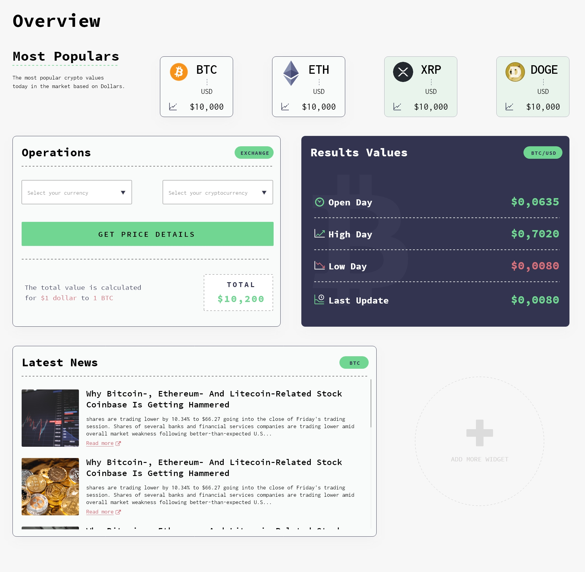

<h1>Crypto Currency webapp(responsive)</h1>
<h2>What does contains?</h2>

This project in particular using an external API to get all these results

Like The last Price, The current price, NEWS, and much more

<h2>What I used for this?</h2>

I used for this Overview page ***SCSS**, ***VANILLA JS**, **PUG to generate dynamic data

Any question let me know!

